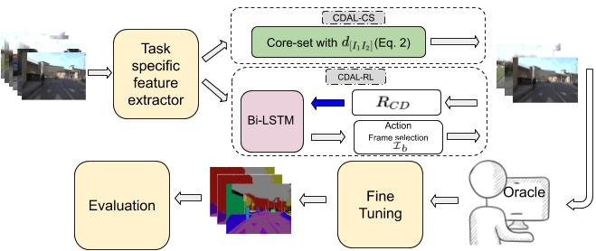

# CDAL in PyTorch
PyTorch implementation of CDAL "[Contextual Diversity for Active Learning]"(https://arxiv.org/pdf/2008.05723.pdf) accepted in ECCV20.

Sharat Agarwal, Himanshu Arora, Saket Anand, Chetan Arora 

*First two authors contributed equally*


## Citation
If using this code, parts of it, or developments from it, please cite our paper:
```

```
## Abstract
Requirement of large annotated datasets restrict the use of deep convolutional neural networks (CNNs) for many practical applications. The problem can be mitigated by using active learning (AL) techniques which, under a given annotation budget, allow to select a subset of data that yields maximum accuracy upon fine tuning. State of the art AL approaches typically rely on measures of visual diversity or prediction uncertainty, which are unable to effectively capture the variations in spatial context. On the other hand, modern CNN architectures make heavy use of spatial context for achieving highly accurate predictions. Since the context is difficult to evaluate in the absence of ground-truth labels, we introduce the notion of contextual diversity that captures the confusion associated with spatially co-occurring classes. Contextual Diversity (CD) hinges on a crucial observation that the probability vector predicted by a CNN for a region of interest typically contains information from a larger receptive field. Exploiting this observation, we use the proposed CD mea- sure within two AL frameworks: (1) a core-set based strategy and (2) a reinforcement learning based policy, for active frame selection. Our exten- sive empirical evaluation establish state of the art results for active learn- ing on benchmark datasets of Semantic Segmentation, Object Detection and Image classification. Our ablation studies show clear advantages of using contextual diversity for active learning.

## Proposed Architecture


### Prerequisites:
* Python 3.6
* Pytorch >= 0.4.1
* CUDA 9.0 or higher
* CPU compatible but NVIDIA GPU + CUDA CuDNN is recommended.

### Installation
Clone the repo:
```bash
$ git clone https://github.com/sharat29ag/CDAL
$ cd CDAL
```
### Frame Selection
By default, logs are stored in ```<root_dir>/log``` with this structure:
```bash
<root_dir>/experiments/logs
```
Sample features in features folder for PASCAL-VOC.

For weighted features:
```bash
python preprocess.py
```
Change the path to raw features in the preprocess.py

Creates a folder <root_dir>/features2 with weighted features.

For CDAL-RL selection:
```bash
python main.py --number_of_picks <number of frames to select> --path_to_features <path to weighted features> --classes <number of classes in dataset> --gpu 1 --save-dir log/summe-split0 --start_idx 0
```
List of selected samples will be stored in <root_dir>/selection/

## Base Networks
- [Semantic Segmentation](https://github.com/fyu/drn)
- [Object Detection](https://github.com/amdegroot/ssd.pytorch)
- [Image Classification](https://github.com/kuangliu/pytorch-cifar)

## Acknowledgements
This codebase is borrwed from [VSUMM](https://github.com/KaiyangZhou/pytorch-vsumm-reinforce)

## Contact
If there are any questions or concerns feel free to send a message at sharata@iiitd.ac.in

